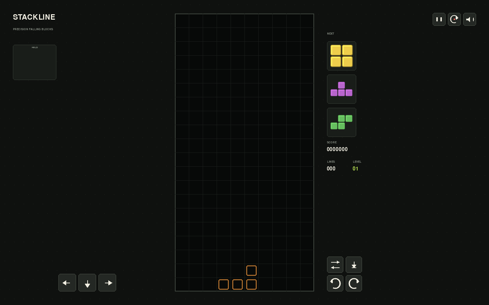
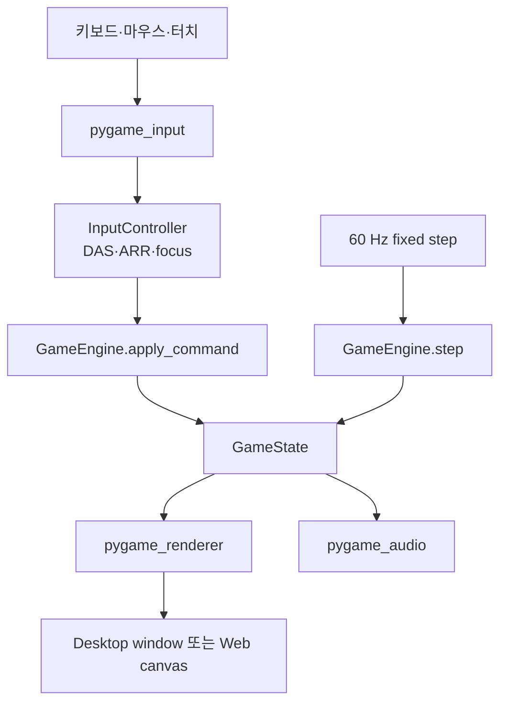

# Stackline

Stackline은 Python으로 작성한 결정론적 낙하 블록 게임입니다. 하나의 `pygame-ce`
클라이언트를 네이티브 데스크톱과 `pygbag`/WebAssembly 브라우저 환경에서 함께 실행합니다.
웹 결과물은 GitHub Pages에 올릴 수 있는 정적 파일이며 백엔드, 계정, 데이터베이스,
WebSocket 연결이 필요하지 않습니다.



## 문서 안내

이 README는 사용법뿐 아니라 프로젝트를 처음부터 다시 이해하거나 재구현할 때 참고할 수
있도록 **목표 설정 → 사전 조사 → 계획 → 구조 설계 → 구현 → 웹 통합 문제 해결 → 검증**
순서로 작성한 제작 기록입니다.

- 계층 경계와 결정론 계약의 상세 설명: [아키텍처](docs/architecture.md)
- 비교 프로젝트와 기술 선택의 원문 근거: [참고 프로젝트 조사](docs/references.md)
- 현재 구현의 최종 기준: 이 저장소의 코드와 자동화 테스트

이 저장소의 README와 `docs/` 문서를 포함한 프로젝트 전반의 문서는 반드시 한국어로
작성하고 유지합니다. 외부 기술명, 코드 식별자, 파일 경로, 명령어는 정확성을 위해 원문을
유지할 수 있습니다.

## 바로 플레이

GitHub Pages 배포 주소는 다음과 같습니다.

<https://hahaysh.github.io/tetris/>

기본 브랜치에서 Pages workflow가 성공한 뒤 배포본을 사용할 수 있습니다. 로컬에서 바로
검증하려면 아래의 [로컬 실행](#로컬-실행)과 [웹 빌드와 실행](#웹-빌드와-실행)을 따릅니다.

## 프로젝트 목표

처음부터 목표는 단순히 화면에 블록을 그리는 데 그치지 않고, 규칙을 재현 가능하게
검증하면서 같은 Python 코드가 데스크톱과 브라우저에서 작동하는 작은 완성품을 만드는
것이었습니다.

| 목표 | 완료 기준 | 구현 결과 |
| --- | --- | --- |
| Python 중심 구현 | 게임 규칙과 클라이언트가 Python에 존재 | `src/tetris_web/`에 전체 구현 |
| 동일한 실행 경로 | 네이티브와 웹이 같은 진입점과 runtime 사용 | `main.py`와 비동기 `runtime.py` 공유 |
| 결정론적 규칙 | 같은 seed와 command/tick 열이 같은 상태 생성 | seed 기반 7-bag, 60 Hz 고정 step, replay 테스트 |
| 실제 플레이 가능성 | 핵심 현대식 낙하 블록 조작 제공 | SRS, hold, ghost, next, lock delay, DAS/ARR |
| 데스크톱·모바일 대응 | 키보드와 화면 조작, 가로·세로 배치 지원 | 키보드·마우스·멀티터치 command 통합 |
| 정적 배포 | 서버 애플리케이션 없이 URL에서 실행 | pygbag artifact와 GitHub Pages workflow |
| 회귀 방지 | 렌더링 없이 규칙을 검증하고 빌드를 자동 확인 | 44개 pytest case, Ruff, headless smoke, web build |

## 사전 조사와 기술 선택

구현 전에 브라우저 낙하 블록 게임과 Python 웹 runtime을 조사했습니다. 조사 단계에서는
코드 복사보다 다음 질문에 답하는 데 집중했습니다.

- 표준적인 회전, 생성, lock, hold 규칙을 어떤 단위로 분리해야 하는가?
- 입력 반복을 운영체제나 브라우저 이벤트 빈도에 맡기지 않으려면 무엇이 필요한가?
- Python 규칙을 브라우저에서 실행하면서 테스트 가능한 구조를 유지할 수 있는가?
- single-player MVP에 backend가 정말 필요한가?

### 비교 프로젝트에서 얻은 설계 기준

| 프로젝트 | 확인한 내용 | Stackline에 반영한 방식 |
| --- | --- | --- |
| `simonlc/tetr.js` | SRS, 7-bag, lock delay, DAS/ARR, hold, ghost | 기능 checklist만 참고하고 Python 규칙과 테스트를 새로 작성 |
| `mimshwright/mimstris` | 작은 matrix utility와 상태 관심사 분리 | 보드, 조각, 점수, 생성기를 작은 도메인 module로 분리 |
| `Vibe-Tetris-Pygame-Web` | pygame 비동기 loop와 pygbag 배포 가능성 | 웹 실행 가능성만 확인하고 단일 파일 구조는 채택하지 않음 |
| `flatris` | action 중심 상태 변경과 공유 reducer | 향후 multiplayer 경계 참고용으로만 보존 |
| `react-tetris` | 터치 UI, focus pause, 제어된 입력 반복 | UX 동작을 참고해 command model과 focus 처리를 설계 |

각 저장소의 활동성, license 제약, 제외한 pattern은
[참고 프로젝트 조사](docs/references.md)에 기록했습니다. 외부 프로젝트의 코드, 그림, 소리,
이름, branding은 가져오지 않았습니다.

### 검토한 기술 조합

| 선택지 | 장점 | 이 프로젝트에서의 판단 |
| --- | --- | --- |
| `pygame-ce` + `pygbag` | 규칙·입력·렌더링을 Python 한 경로로 유지, 정적 배포 가능 | **채택**. canvas 게임과 MVP 범위에 가장 직접적 |
| PyScript/Pyodide + JavaScript canvas | DOM과 접근성 제어가 유연함 | Python/JavaScript interop와 이중 테스트 표면이 불필요하게 큼 |
| Python backend + TypeScript client | 계정, 권위 있는 점수, multiplayer에 적합 | offline single-player에는 운영 복잡도만 추가하므로 제외 |

`pygame-ce`와 `pygbag`을 선택한 대가로 초기 WebAssembly 다운로드, 비동기 event loop 제약,
version별 bootstrap 차이를 직접 다뤄야 했습니다. 이 trade-off는 뒤의
[pygbag 웹 통합과 문제 해결](#pygbag-웹-통합과-문제-해결)에 남겼습니다.

## MVP 범위

### 포함한 기능

- 10 × 20 표시 영역과 4개의 숨김 행
- seed 기반 7-bag과 5개 next queue
- JLSTZ/I 조각의 SRS wall kick과 양방향 회전
- hold, ghost piece, soft drop, hard drop
- gravity, lock delay, lock reset 제한, line clear, 점수와 레벨
- 60 Hz tick 기반 DAS/ARR 및 soft drop 반복
- pause, restart, game over, mute와 생성형 효과음
- 키보드, 마우스, 멀티터치 조작
- 가로형 desktop과 세로형 mobile 레이아웃
- 네이티브 실행, 정적 웹 빌드, GitHub Pages 배포 자동화

### 의도적으로 제외한 기능

현재 버전은 정적 single-player MVP입니다. 계정, 온라인 leaderboard, multiplayer,
입력 replay UI, PWA offline cache, 키 설정 변경, 로컬 기록 저장, 고급 T-spin/combo/back-to-back
점수 계산은 포함하지 않습니다. 이 범위를 먼저 고정했기 때문에 backend나 JavaScript client를
선행 구축하지 않고 게임 규칙과 웹 실행 품질에 집중할 수 있었습니다.

## 구현 계획과 진행 순서

구현은 조사와 설계 검토를 먼저 마친 뒤 아래 순서로 진행했습니다. 각 단계가 다음 단계의
검증 가능한 기반이 되도록 domain에서 browser 바깥쪽으로 확장했습니다.

| 단계 | 계획한 작업 | 완료 결과와 확인 방법 |
| --- | --- | --- |
| 0. 조사·승인 | 유사 프로젝트, runtime 후보, MVP와 non-goal 정리 | `docs/references.md` 작성 후 구현 방향 확정 |
| 1. 기반 구성 | packaging, source layout, test/lint 설정 | `pyproject.toml`, `src/`, `tests/`, `main.py` 구성 |
| 2. 도메인 규칙 | 상태, 보드, 조각, SRS, 7-bag, 점수, 엔진 | pygame 없이 실행되는 순수 Python 규칙과 단위 테스트 |
| 3. 입력·runtime | command 처리, DAS/ARR, 고정 step loop | tick 단위 입력 반복과 네이티브 플레이 검증 |
| 4. 표현 계층 | 반응형 renderer, 키보드·터치, 합성 오디오 | desktop/mobile 레이아웃과 공통 command 경로 |
| 5. 웹 통합 | pygbag template, wheel preload, canvas resize | 실제 브라우저 network/canvas/input 검증 |
| 6. 자동화·문서 | CI, Pages, architecture와 제작 기록 | lint/test/smoke/web build 및 정적 배포 workflow |

이 순서의 핵심은 렌더링을 먼저 만든 뒤 규칙을 끼워 맞추지 않는 것입니다. 보드와 엔진을
headless 상태에서 먼저 검증했기 때문에 브라우저 문제와 게임 규칙 문제를 분리해서 추적할 수
있었습니다.

## 전체 아키텍처

게임 상태를 변경할 권한은 도메인 엔진에만 있습니다. pygame 계층은 사용자 의도를
`Command`로 바꾸고 현재 상태를 그리거나 소리를 재생할 뿐, 보드 규칙을 직접 구현하지
않습니다.



### 계층별 책임

| 계층 | 책임 | 의존성 원칙 |
| --- | --- | --- |
| `domain` | 보드, 조각, 난수, 점수, 상태 전이 | pygame, 브라우저, wall clock을 모름 |
| `app` | 입력 반복과 fixed-step runtime 조율 | domain을 호출하되 규칙을 복제하지 않음 |
| `adapters` | pygame event, 렌더링, 오디오 | 외부 입출력을 domain command/state로 변환 |
| 진입점·웹 host | runtime 시작과 WebAssembly bootstrap | application 내부 규칙을 모름 |

한 frame의 제어 흐름은 다음과 같습니다.

1. `pygame_input.py`가 pygame event를 press/release와 `Command`로 변환합니다.
2. `InputController`가 현재 tick에서 DAS/ARR 반복 command를 생성합니다.
3. `GameEngine.apply_command()`가 즉시 조작을 반영합니다.
4. accumulator에 쌓인 시간만큼 `GameEngine.step()`을 60 Hz 단위로 실행합니다.
5. renderer와 audio adapter가 새 `GameState`를 읽어 화면과 효과음을 갱신합니다.
6. browser runtime에 제어권을 돌려주기 위해 loop 끝에서 비동기 yield를 수행합니다.

## 프로젝트 구조

```text
.
├─ main.py                          네이티브/pygbag 공통 진입점
├─ pyproject.toml                   Python 범위, dependency, pytest, Ruff 설정
├─ pygbag.ini                       웹 archive 포함·제외 규칙
├─ src/tetris_web/
│  ├─ domain/
│  │  ├─ model.py                   enum과 게임 상태 model
│  │  ├─ board.py                   충돌, 배치, 투영, 줄 제거
│  │  ├─ tetrominoes.py             조각 좌표와 SRS kick table
│  │  ├─ randomizer.py              seed 기반 7-bag
│  │  ├─ scoring.py                 점수, 레벨, 중력 곡선
│  │  └─ engine.py                  command, 중력, lock, spawn, top-out
│  ├─ app/
│  │  ├─ controller.py              DAS/ARR와 focus 상태
│  │  └─ runtime.py                 async fixed-step client loop
│  └─ adapters/
│     ├─ pygame_input.py             키보드·pointer·touch 매핑
│     ├─ pygame_renderer.py          반응형 화면 구성
│     └─ pygame_audio.py             실행 시 생성하는 효과음
├─ tests/
│  ├─ domain/                        보드·엔진·난수·점수·SRS 테스트
│  ├─ app/                           controller 반복·focus 테스트
│  └─ adapters/                      입력과 renderer smoke 테스트
├─ web/index.tmpl                    custom pygbag HTML bootstrap
├─ static/                           브라우저 identity asset
├─ docs/
│  ├─ architecture.md                상세 설계와 runtime 계약
│  ├─ references.md                  구현 전 조사 기록
│  └─ assets/                        검증 screenshot
└─ .github/workflows/
  ├─ ci.yml                         lint/test/native smoke/web build
  └─ pages.yml                      Pages artifact build/deploy
```

## 핵심 규칙 구현

### 상태와 command model

`model.py`는 `GameState`, `ActivePiece`, `PieceType`, `Rotation`, `Command` 등 도메인에서
공유하는 자료형을 정의합니다. 입력 adapter는 키 이름이나 touch 좌표를 엔진에 넘기지 않고
`MOVE_LEFT`, `ROTATE_CLOCKWISE`, `HARD_DROP` 같은 의도만 전달합니다. 이 경계 덕분에 키보드와
화면 버튼이 같은 규칙 경로를 사용하고 테스트도 pygame event 없이 command 단위로 작성할 수
있습니다.

### 보드와 좌표계

- 보드 폭은 10칸입니다.
- 화면에 보이는 높이는 20칸입니다.
- spawn과 top-out 판정을 위한 숨김 행 4칸을 더해 내부 높이는 24칸입니다.
- `board.py`가 충돌 검사, 조각 배치, 완성 행 제거, ghost 착지점 투영을 담당합니다.
- 새 조각을 놓을 수 없거나 잠긴 블록이 숨김 행에 남으면 game over로 전환합니다.

표시 영역과 규칙 영역을 분리했기 때문에 spawn 직후 조각 일부가 화면 위에 있어도 별도 예외
처리 없이 같은 충돌 함수를 사용할 수 있습니다.

### 7-bag 생성기

`randomizer.py`는 `random.Random(seed)` 전용 instance로 7개 조각을 섞습니다. 한 bag에는
I, J, L, O, S, T, Z가 정확히 한 번씩 들어가며, queue가 부족해질 때 새 bag을 이어 붙입니다.
전역 난수 상태를 사용하지 않으므로 같은 seed와 같은 command/tick 열은 같은 조각 순서와
게임 상태를 만듭니다.

### SRS 회전

`tetrominoes.py`에는 조각별 네 방향 좌표와 table 기반 Super Rotation System kick이
있습니다.

- J, L, S, T, Z는 공통 JLSTZ kick table을 사용합니다.
- I는 형상이 달라 별도 I kick table을 사용합니다.
- 각 회전은 기본 위치부터 최대 5개의 offset 후보를 순서대로 검사합니다.
- 시계 방향과 반시계 방향 전이를 모두 지원합니다.
- 모든 후보가 충돌하면 위치와 회전 상태를 바꾸지 않습니다.
- O는 회전 입력으로 형상이 바뀌지 않습니다.

### 고정 tick과 중력

시뮬레이션은 wall clock frame 수가 아니라 초당 60개의 고정 tick으로 진행됩니다.
`runtime.py`가 실제 경과 시간을 accumulator에 더하고 필요한 수만큼 엔진 step을 호출합니다.
느린 frame이 생겨도 한 번에 반영하는 경과 시간은 0.25초로 제한해 지나친 catch-up을
방지합니다. 렌더링은 최대 120 FPS로 실행될 수 있지만 규칙 결과는 렌더 frame rate에
의존하지 않습니다.

레벨별 한 칸 낙하 간격은 다음과 같습니다.

| 레벨 | 1 | 2 | 3 | 4 | 5 | 6 | 7 | 8 | 9 | 10 | 11 이상 |
| --- | --- | --- | --- | --- | --- | --- | --- | --- | --- | --- | --- |
| tick | 48 | 43 | 38 | 33 | 28 | 23 | 18 | 13 | 8 | 6 | 5 |

레벨 1의 자동 낙하는 0.8초마다 한 칸이며, 레벨 11 이상에서는 5 tick, 즉 약 0.083초마다
한 칸으로 제한됩니다.

### Lock delay와 reset 제한

조각이 바닥이나 쌓인 블록에 닿았다고 즉시 고정하지 않습니다.

| 설정 | 값 | 60 Hz 기준 의미 |
| --- | --- | --- |
| `LOCK_DELAY_TICKS` | 30 tick | 약 0.5초 뒤 고정 |
| `LOCK_RESET_LIMIT` | 15회 | 접지 중 이동·회전으로 미룰 수 있는 횟수 제한 |

성공한 이동이나 회전으로 접지 상태가 달라지면 lock timer를 재설정할 수 있지만, 한 조각에서
15회를 넘길 수 없습니다. 이 제한은 바닥에서 조각을 무기한 움직여 게임을 멈추는 상황을
막습니다.

### 점수, 줄, 레벨

줄 제거 기본 점수에 현재 레벨을 곱합니다.

| 한 번에 제거한 줄 | 이름 | 기본 점수 |
| --- | --- | --- |
| 0 | 없음 | 0 |
| 1 | Single | 100 × level |
| 2 | Double | 300 × level |
| 3 | Triple | 500 × level |
| 4 | Tetris | 800 × level |

- Soft drop은 직접 내린 거리 1칸당 1점을 더합니다.
- Hard drop은 즉시 내린 거리 1칸당 2점을 더합니다.
- 누적 10줄마다 레벨이 오르며 `level = lines // 10 + 1`입니다.
- T-spin, combo, back-to-back 보너스는 현재 MVP 점수표에 없습니다.

### Hold, next, ghost

- Hold가 비어 있으면 현재 조각을 저장하고 queue에서 새 조각을 꺼냅니다.
- Hold가 차 있으면 현재 조각과 저장된 조각을 교환합니다.
- 한 조각이 spawn된 뒤 lock되기 전에는 hold를 한 번만 사용할 수 있습니다.
- 화면에는 다음 조각 5개를 미리 보여 줍니다.
- Ghost는 현재 조각을 충돌 직전까지 투영한 결과이며 보드 상태를 변경하지 않습니다.

## 입력과 사용자 인터페이스

### 키보드 조작

| 동작 | 키보드 |
| --- | --- |
| 좌우 이동 | `Left` / `Right` 또는 `A` / `D` |
| Soft drop | `Down` 또는 `S` |
| Hard drop | `Space` |
| 시계 방향 회전 | `Up`, `W`, `X` |
| 반시계 방향 회전 | `Z` 또는 `Q` |
| Hold | `C` 또는 좌우 `Shift` |
| 일시 정지 | `P` 또는 `Escape` |
| 다시 시작 | `R` |

모든 핵심 동작은 화면 버튼으로도 실행할 수 있습니다. pointer와 touch event는 키보드와 같은
`Command`로 바뀌므로 장치별로 게임 규칙이 달라지지 않습니다. touch 식별자를 따로 추적해
여러 버튼을 동시에 누를 수 있습니다. 음소거는 화면의 전용 버튼으로 전환합니다.

### 결정론적 입력 반복

운영체제의 key repeat는 플랫폼마다 지연과 빈도가 다르므로 사용하지 않습니다.
`InputController`가 press/release 상태를 저장하고 simulation tick으로 반복을 만듭니다.

| 입력 설정 | 값 | 60 Hz 기준 |
| --- | --- | --- |
| DAS | 10 tick | 누른 뒤 약 167 ms에 좌우 반복 시작 |
| ARR | 2 tick | 이후 약 33 ms마다 좌우 이동 |
| Soft drop 반복 | 2 tick | 약 33 ms마다 한 칸 하강 |

창이나 browser tab이 focus를 잃으면 눌린 상태를 모두 해제하고 게임을 일시 정지합니다. 다시
focus를 얻었을 때 이전 입력이 붙어서 계속 움직이는 문제를 방지하기 위한 처리입니다.

### 반응형 renderer

초기 화면은 1000 × 720이며 runtime은 최소 320 × 480까지의 resize를 처리합니다. renderer는
다음 조건으로 배치를 선택합니다.

```python
portrait = height > width * 1.05 or width < 700
```

- 가로 배치에서는 hold, 보드, next/상태 panel을 좌우로 구성합니다.
- 세로 배치에서는 보드를 우선 배치하고 touch control을 아래쪽에 둡니다.
- 보드 cell 크기와 panel 위치는 매 frame의 실제 surface 크기에서 계산합니다.
- ghost, active piece, locked cell, 줄 제거 feedback은 같은 board geometry를 공유합니다.

### 오디오

효과음은 외부 음원 파일을 싣지 않고 `pygame_audio.py`에서 파형을 합성해 생성합니다. 이동,
회전, lock, 줄 제거 등 상태 변화에 맞춰 재생하며 mixer를 사용할 수 없는 headless 환경에서는
게임 실행을 막지 않습니다. 브라우저에서는 autoplay 정책을 지키기 위해 사용자 gesture 이후
오디오를 활성화하고 화면 control로 음소거할 수 있습니다.

## pygbag 웹 통합과 문제 해결

웹 빌드가 파일을 생성하는 것과 실제 브라우저에서 게임이 시작되는 것은 별개의 검증
대상이었습니다. pygbag 0.9.3과 custom template을 통합하면서 다음 문제를 실제 network,
canvas 크기, pixel 변화, 입력으로 하나씩 확인했습니다.

| 순서 | 증상 | 원인 | 적용한 해결책 |
| --- | --- | --- | --- |
| 1 | `PyMain: BrowserFS not found` | runtime이 기대한 BrowserFS CDN 경로와 실제 배포 파일 불일치 | `web/index.tmpl`에서 BrowserFS 1.4.3 URL을 명시적으로 고정 |
| 2 | pygame wheel을 불러오지 못함 | pygbag scanner가 진입점 아래의 local import를 재귀 탐색하지 않음 | `main.py` module scope에 `import pygame`을 두어 preload 대상 표시 |
| 3 | localhost wheel URL이 잘못 바뀜 | 0.9.3이 8000번대 port를 개발 서버로 판단해 CDN 주소 rewrite | local QA server를 9000번 port에서 실행 |
| 4 | loading overlay가 계속 화면을 가림 | template의 `display: grid`가 HTML `hidden` 속성보다 우선 | `[hidden] { display: none !important; }` 추가 |
| 5 | canvas가 정사각형처럼 남고 세로 화면이 갱신되지 않음 | CSS 표시 크기와 SDL framebuffer 소유권 불일치 | `user_canvas_managed: 1`로 host가 canvas 크기를 관리하도록 설정 |
| 6 | clean build에서 archive가 생성되지 않음 | pygbag이 없는 output directory를 항상 만들지 않음 | build 전에 `build/web`을 명시적으로 생성 |

이 기록에서 중요한 점은 HTML이 열렸다는 사실만으로 성공을 판단하지 않은 것입니다. 최종
browser QA에서는 runtime과 wheel 요청의 HTTP 200 응답, canvas의 intrinsic 크기, non-blank
pixel, desktop/mobile 재배치, keyboard/touch hard drop에 따른 화면 변화를 각각 확인했습니다.

`pygbag.ini`는 source archive에 runtime에 필요한 파일만 들어가도록 cache, test, build,
개발 도구 파일을 제외합니다. `web/index.tmpl`은 유효한 단일 `<head>`, viewport, loading UI,
BrowserFS pin, canvas ownership을 함께 관리합니다.

## 로컬 실행

### 요구 환경

- Python 3.12, 3.13 또는 3.14
- 웹 runtime과 가장 가까운 권장 개발 버전: Python 3.12
- runtime dependency: `pygame-ce>=2.5.5,<3`
- web dependency: `pygbag==0.9.3`

PowerShell에서 가상환경과 전체 개발 dependency를 준비합니다.

```powershell
py -3.12 -m venv .venv
.\.venv\Scripts\Activate.ps1
python -m pip install --upgrade pip
python -m pip install -e ".[dev,web]"
```

네이티브 클라이언트를 실행합니다.

```powershell
python main.py
```

테스트와 lint를 실행합니다.

```powershell
python -m pytest
python -m ruff check .
```

## 웹 빌드와 실행

정적 production artifact를 생성합니다. 첫 줄은 clean checkout에서도 output directory가
존재하도록 보장합니다.

```powershell
New-Item -ItemType Directory -Force build/web | Out-Null
python -m pygbag --build --title STACKLINE --package io.github.stackline.web `
  --width 1000 --height 720 --ume_block 0 --template web/index.tmpl .
```

생성된 파일을 local HTTP server로 제공합니다.

```powershell
python -m http.server 9000 --directory build/web
```

브라우저에서 <http://localhost:9000/>을 엽니다. WebAssembly runtime은 HTTP 전송이
필요하므로 `build/web/index.html`을 파일로 직접 열면 안 됩니다. 9000번 port는 pygbag
0.9.3의 localhost CDN rewrite를 피하기 위한 검증된 값입니다.

정상 빌드의 핵심 artifact는 다음 두 파일입니다.

```text
build/web/index.html
build/web/tetris.tar.gz
```

## 테스트와 검증

최종 점검 기준으로 Python 3.12에서 **44개 pytest case가 수집되고 모두 통과**합니다. 테스트는
현재 구현의 공개 동작을 기준으로 하며 pygame이 필요 없는 도메인 검증을 가장 큰 비중으로
둡니다.

| 테스트 영역 | 검증 내용 |
| --- | --- |
| `test_board.py` | 경계·블록 충돌, 배치, 줄 제거, ghost 투영, 숨김 행 |
| `test_engine.py` | spawn, gravity, hard drop, hold, lock delay/reset, top-out, pause, 결정론 replay |
| `test_randomizer.py` | bag 구성, seed 재현성, queue peek |
| `test_scoring.py` | 줄 점수, 레벨 증가, 중력 하한 |
| `test_srs.py` | JLSTZ/I kick, 막힌 회전, 반시계 회전 |
| `test_controller.py` | DAS, ARR, soft drop 반복, focus loss, pause |
| `test_pygame_input.py` | 키보드, pointer, touch, focus, mute 매핑 |
| `test_pygame_renderer.py` | 가로·세로 layout 경계와 non-blank surface |

CI는 다음 네 단계를 독립적으로 실행합니다.

1. `python -m ruff check .`
2. `python -m pytest`
3. dummy SDL video/audio driver로 `main.py`를 2 frame 실행하는 native smoke test
4. pygbag production build 후 `index.html`과 `tetris.tar.gz`가 비어 있지 않은지 확인

자동 검사 외에 완료 시점에 다음 browser 동작을 수동으로 검증했습니다.

- 1440 × 900 desktop viewport에서 가로 layout과 keyboard hard drop
- 390 × 844 mobile viewport에서 세로 layout과 touch hard drop
- runtime, BrowserFS, pygame wheel 요청의 HTTP 200 응답
- loading overlay 제거와 non-blank canvas pixel
- resize 뒤 CSS 표시 크기와 실제 framebuffer의 일치
- browser console의 실행 차단 오류 없음

## CI와 GitHub Pages

`.github/workflows/ci.yml`은 source 품질과 두 runtime의 최소 실행 가능성을 검사합니다.
`.github/workflows/pages.yml`은 같은 pygbag 설정으로 `build/web`을 만들고 `.nojekyll`을 추가한
뒤 GitHub Pages artifact로 업로드·배포합니다.

두 workflow 모두 local build와 같은 `pygbag==0.9.3`, title, package id, viewport,
`web/index.tmpl`을 사용합니다. local과 CI가 다른 bootstrap을 만드는 상황을 피하기 위한
구성입니다.

## 주요 설계 결정과 이유

| 결정 | 이유 | 감수한 비용 |
| --- | --- | --- |
| 규칙을 순수 Python domain으로 분리 | 렌더링 없이 빠르고 결정론적으로 테스트 | adapter와 상태 model 경계를 별도 관리 |
| 60 Hz fixed step 사용 | 장치 frame rate와 무관한 gravity/input 결과 | accumulator와 catch-up 제한 필요 |
| 입력을 `Command`로 통합 | keyboard/touch가 같은 규칙 사용 | press/release와 touch id 추적 필요 |
| 정적 single-player로 시작 | 배포와 운영을 단순화하고 핵심 게임에 집중 | 계정, leaderboard, multiplayer 없음 |
| 오디오를 실행 시 합성 | 외부 asset/license와 다운로드를 줄임 | mixer/browser gesture 차이를 처리해야 함 |
| custom pygbag template 유지 | 0.9.3 bootstrap과 responsive canvas 문제 해결 | pygbag upgrade 때 호환성 재검증 필요 |

## 현재 한계와 후속 계획

현재 구조는 의도한 MVP를 완성하지만 다음 기능은 별도 설계가 필요합니다.

1. T-spin, combo, back-to-back을 추가하려면 마지막 성공 회전과 line clear 문맥을 상태에
  명시적으로 보존하고 점수 테스트를 먼저 확장해야 합니다.
2. Replay를 추가하려면 seed뿐 아니라 tick별 command press/release 열과 game version을 함께
  저장해야 합니다.
3. 키 설정과 접근성 개선은 `Command` 경계를 유지한 채 입력 adapter와 설정 저장소를 추가하는
  방식이 적합합니다.
4. PWA offline cache를 도입할 때는 pygbag runtime, wheel, BrowserFS CDN까지 cache 대상과
  version 무효화 정책을 함께 설계해야 합니다.
5. Online leaderboard나 multiplayer는 신뢰할 수 있는 서버 판정, protocol version,
  reconnect/reconciliation을 먼저 정의한 뒤 backend를 추가해야 합니다.
6. pygbag을 upgrade할 때는 custom template workaround가 여전히 필요한지 하나씩 제거하며
  desktop/mobile browser QA 전체를 다시 수행해야 합니다.

## 유지보수할 때 확인할 곳

- 게임 규칙 변경: `src/tetris_web/domain/`과 대응하는 `tests/domain/`
- 키 반복 변경: `src/tetris_web/app/controller.py`와 `tests/app/test_controller.py`
- 키·touch mapping 변경: `src/tetris_web/adapters/pygame_input.py`
- 화면 배치 변경: `pygame_renderer.py`와 desktop/mobile viewport 검증
- pygbag version 변경: `pyproject.toml`, `main.py`, `web/index.tmpl`, 두 workflow를 함께 확인
- 배포 변경: local web build를 먼저 통과한 뒤 CI와 Pages artifact를 비교

변경 후 최소 완료 조건은 `pytest`, Ruff, native smoke, clean web build입니다. 입력이나 renderer,
template을 바꿨다면 desktop과 mobile browser에서 실제 canvas pixel과 조작 결과까지 확인해야
합니다.

## 제작 원칙

게임 이름, 시각 요소, icon, 생성형 audio는 이 프로젝트를 위해 새로 제작했습니다. 외부
프로젝트에서는 일반적인 mechanic과 architecture pattern만 조사했으며 source code와 asset은
복사하지 않았습니다. 규칙 또는 배포 동작이 바뀌면 코드와 테스트를 먼저 기준으로 삼고 이
README와 `docs/`의 한국어 설명을 같은 변경에서 함께 갱신합니다.
