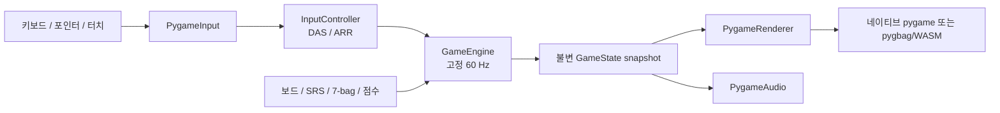

# 아키텍처

Stackline은 게임 규칙을 pygame 및 브라우저 runtime과 분리합니다. 따라서 시뮬레이션은
CPython에서 직접 테스트할 수 있고 pygame 클라이언트는 교체 가능한 I/O 경계로 유지됩니다.

## 경계

### 도메인

`src/tetris_web/domain`은 모든 권위 있는 게임 상태와 상태 전이를 소유합니다.

- `model.py`는 command, piece, rotation, status, game state를 정의합니다.
- `tetrominoes.py`는 방향별 cell과 JLSTZ/I 전용 SRS kick table을 정의합니다.
- `board.py`는 충돌 검사, 투영, 배치, 줄 제거를 담당합니다.
- `randomizer.py`는 전역 난수 상태를 읽지 않는 seed 기반 7-bag을 제공합니다.
- `scoring.py`는 gravity 및 점수 계산을 담당합니다.
- `engine.py`는 command를 적용하고 gravity, lock delay, hold, spawn, top-out을 진행합니다.

도메인은 pygame이나 브라우저 API를 import하지 않으며 실제 시간을 읽지 않습니다.

### 애플리케이션

`InputController`는 press/release 상태를 결정론적 delayed auto shift와 auto repeat로
변환합니다. 운영체제의 키 반복을 무시하므로 네이티브와 브라우저가 같은 입력 timing을
사용합니다.

`runtime.py`는 비동기 클라이언트 loop를 소유합니다. 렌더링은 초당 최대 120 frame으로
실행할 수 있지만 시뮬레이션은 accumulator를 통해 고정 60 Hz step으로 진행합니다. 긴
background 정지 이후 무제한 따라잡기 loop가 생기지 않도록 frame delta에 상한을 둡니다.

### 어댑터

- `PygameInput`은 키보드, 마우스, 정규화된 finger 좌표를 도메인 command로 변환합니다.
- `PygameRenderer`는 framebuffer 크기에서 새 layout을 계산하고 보드, panel, control,
  상태 overlay를 그립니다.
- `PygameAudio`는 저작권이 있는 media를 포함하는 대신 짧은 효과음을 지연 생성합니다.

폭이 좁거나 충분히 긴 framebuffer에서는 세로 layout이 활성화됩니다. Control은 같은
surface에 그려지고 렌더링과 hit test에 동일한 `Layout` 사각형을 사용하므로 시각 좌표와
입력 좌표가 어긋나지 않습니다.

## 결정론 계약

같은 seed와 각 시뮬레이션 tick의 동일한 command가 주어지면 엔진은 항상 같은 상태에
도달해야 합니다. 이 계약은 다음 네 규칙에 의존합니다.

1. Piece 순서는 엔진이 소유한 seed 기반 7-bag에서만 결정합니다.
2. 시뮬레이션 시간은 고정된 `GameEngine.step()` 호출로만 진행합니다.
3. 입력 반복은 host platform이 아니라 `InputController`가 생성합니다.
4. 충돌, 회전, 점수, lock 결정은 현재 상태만 사용하는 순수 계산입니다.

이 계약으로 현재는 재현 가능한 테스트를 제공하고, MVP에 서버를 추가하지 않은 채 향후
command stream replay나 서버 측 검증으로 확장할 수 있습니다.

## 브라우저 Runtime

`pygbag`은 `main.py`와 `src/tetris_web`을 `build/web/tetris.tar.gz`로 묶습니다. 사용자 정의
template은 CPython WebAssembly를 시작하고 archive를 가상 파일시스템에 푼 다음 네이티브와
같은 비동기 진입점을 실행합니다.

브라우저 통합에는 다음과 같은 의도적인 호환성 제약이 있습니다.

- pygbag 0.9.3은 진입점에서 WebAssembly wheel 의존성을 검색하지만 로컬 import를
  재귀적으로 검색하지 않으므로 `main.py`가 module scope에서 `pygame`을 import합니다.
- Main loop는 매 frame마다 `await asyncio.sleep(0)`으로 제어권을 반환합니다.
- Template은 `user_canvas_managed: 1`을 설정합니다. CSS가 viewport 크기를 소유하고 SDL은
  고정 종횡비 CSS 확대가 아니라 실제 framebuffer resize event를 받습니다.
- `[hidden]`을 `display: none`에 명시적으로 연결해 pygbag loading overlay의 grid 선언이
  HTML hidden 상태를 덮지 못하게 합니다.
- 0.9.3 runtime은 BrowserFS 전역을 확인하지만 자체 version CDN 경로에는 파일이 없으므로
  BrowserFS 1.4.3을 고정합니다. Archive 압축 해제 자체는 Python `tarfile`을 사용합니다.

Production 빌드는 정적 파일이며 GitHub Pages 또는 정상적인 HTTP content type을 반환하는
어떤 서버에서도 host할 수 있습니다.

## 검증 전략

도메인 테스트는 보드 연산, SRS 전이, seed bag 무결성, 점수, top-out, hold 제한, lock 동작,
결정론적 command stream을 검증합니다. 애플리케이션 테스트는 DAS/ARR과 focus 처리를
검증합니다. Adapter 테스트는 키보드/포인터/터치 mapping과 두 반응형 layout을 검증합니다.

Release 검증 절차는 다음과 같습니다.

1. CPython에서 `pytest` 및 `ruff` 실행
2. 짧은 headless 네이티브 pygame 실행
3. 깨끗한 pygbag production 빌드 및 archive 내용 검사
4. 실패한 request와 console error가 없는 브라우저 시작 확인
5. 비어 있지 않은 canvas와 키보드/터치 상태 변화 확인
6. Desktop 및 390 x 844 viewport의 resize, overflow, control hit target 확인

## 향후 확장

향후 API는 권위 있는 규칙을 도메인 package 밖으로 옮기지 않고 서명된 점수 제출이나
결정론적 replay를 받을 수 있습니다. Multiplayer에는 protocol 설계, action 순서, 상태
조정, 악용 방지, 서버 simulation이 필요하며 이러한 관심사는 현재 client loop 안에 숨기지
않습니다.
